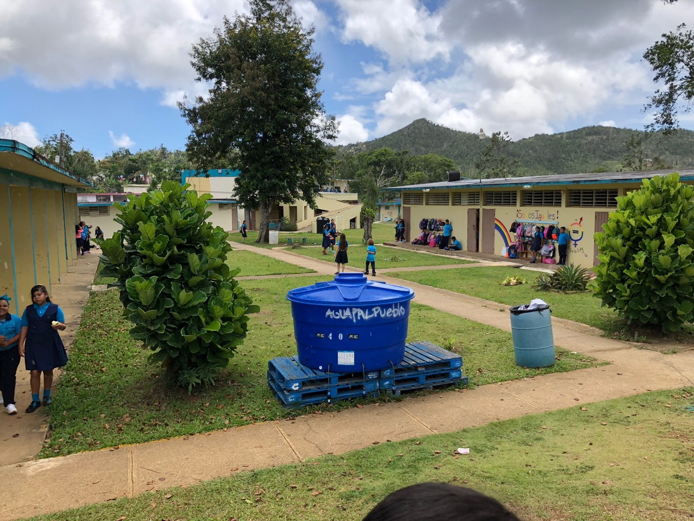
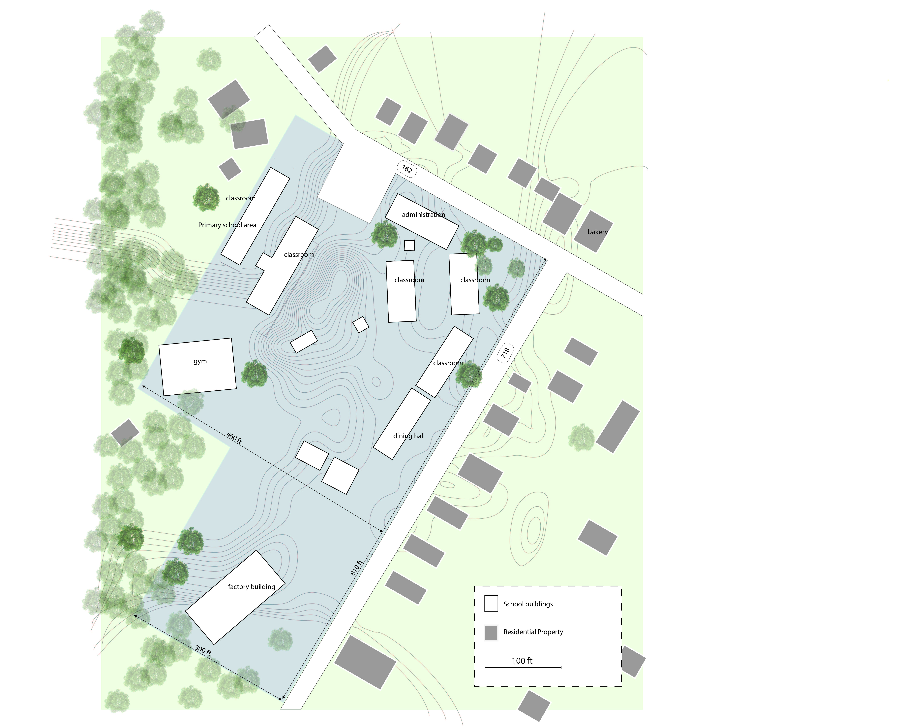
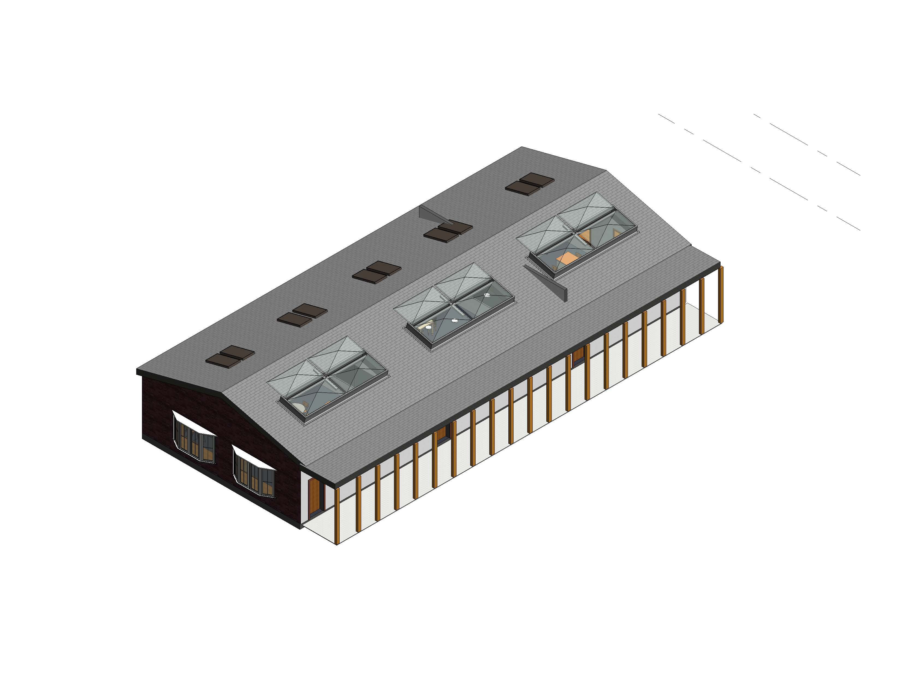
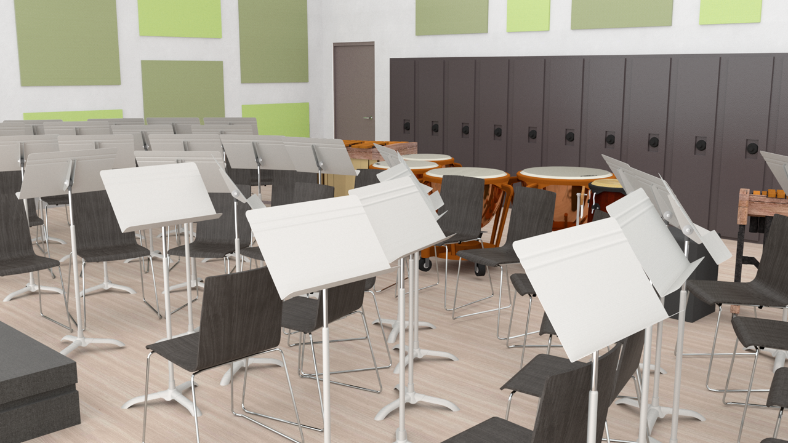
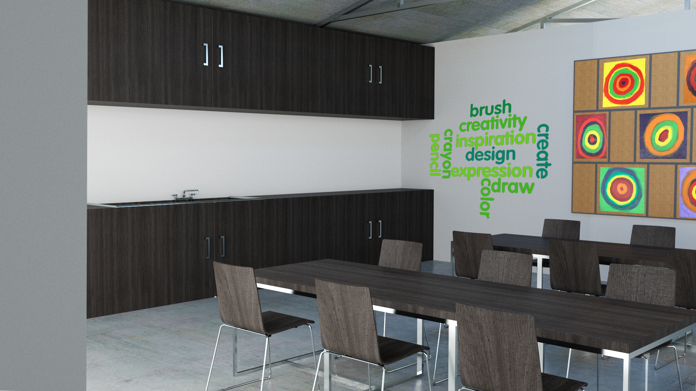
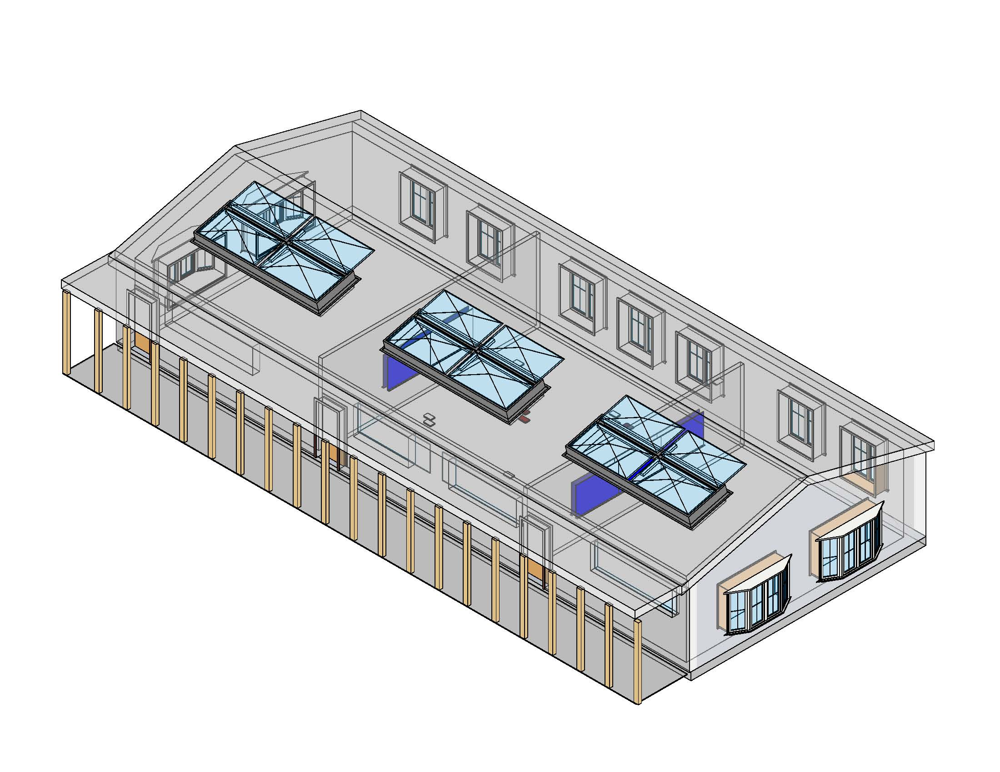
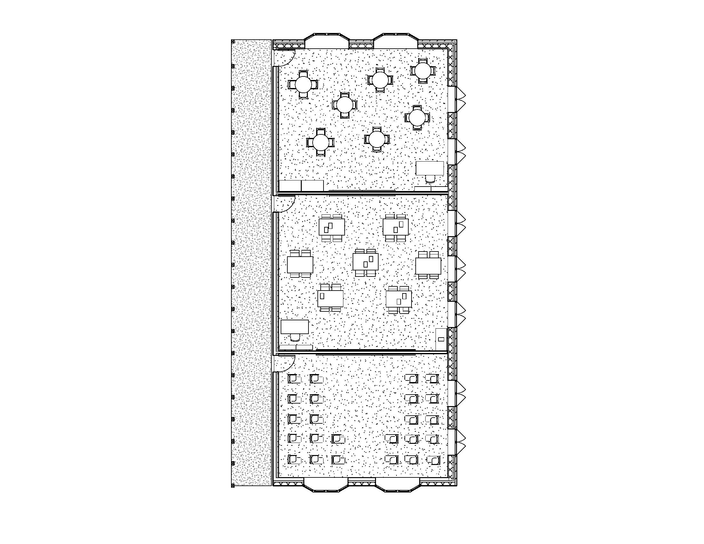
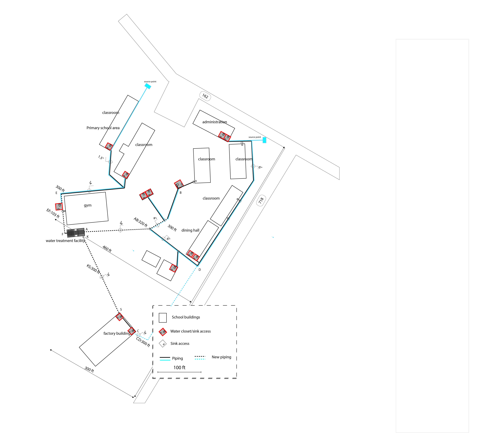
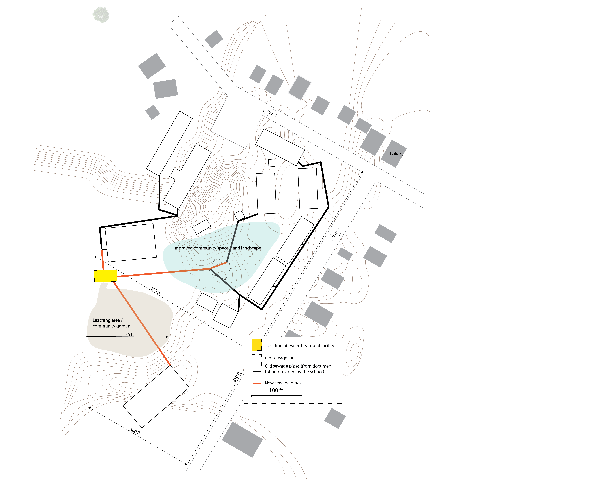
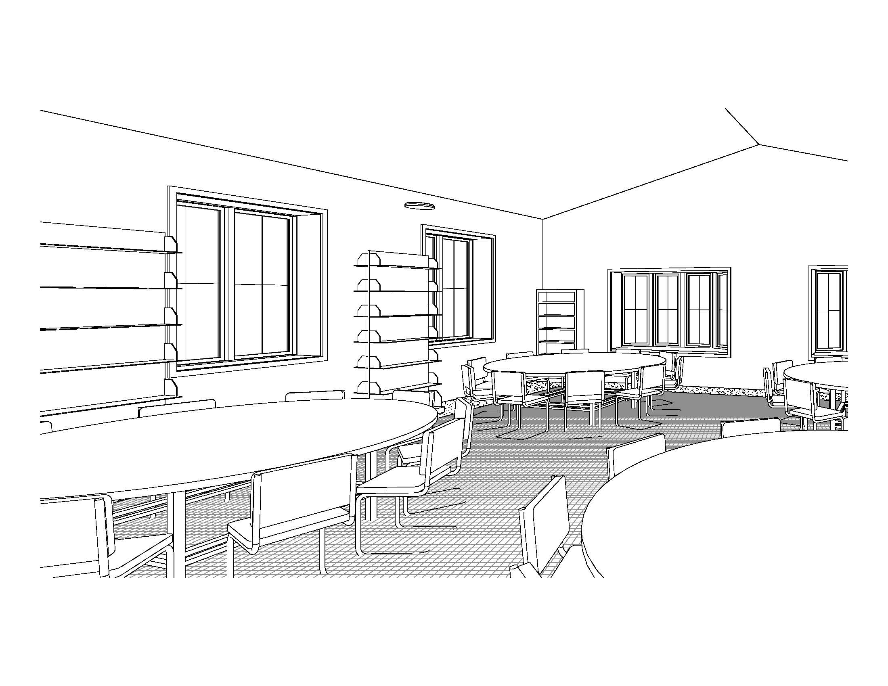

## Overview

Infrastructural and architectural renovations to La Escuela Segunda Unidad Pasto in Aibonito, Puerto Rico, focused on environmental resilience and sustainability following Hurricane Maria (2017). Finalist, 2019 US Department of Energy Solar Decathlon, elementary school division.

*Team: Nikita Klimenka, Hafsa Abdi, Michelle Tong, Jacob Payne, Robbie Skoronski, Kenny Wang*

## Context

After Hurricane Maria made landfall in 2017, the municipality of Aibonito was left without power and water. Like many schools across Puerto Rico, La Escuela Segunda Unidad Pasto became a distribution center for food and supplies in the weeks that followed. Working with school administration and the Yale Open Lab, we proposed a set of renovations to prepare the school for future emergencies while improving everyday sustainability.

## Site and Landscaping

Landscaping of the outdoor campus serves two purposes: freeing up accessible space for student use, and directing gray water along intentional channels to reduce flooding and erosion.

## Building Envelope

Changes to the building envelope improve resistance to moisture and extreme winds.

## Community Space

An abandoned factory building adjacent to the school was incorporated into the renovation as a multipurpose activity and meeting space for students and the community, doubling as an emergency shelter. The renovated factory also includes dedicated music and art rooms.

## Plumbing

Plumbing — including graywater and blackwater storage and treatment — poses a logistical challenge and health hazard at the school. The proposal includes a graywater runoff system, an industrial septic system, and a leeching field to neutralize sewage water.

