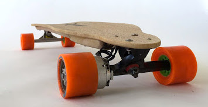
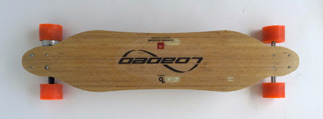
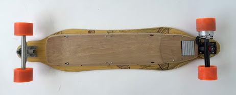
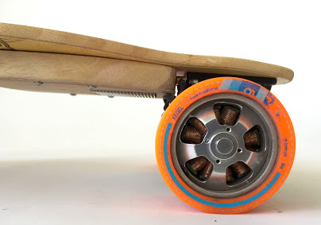

## Overview

A longboard retrofitted with a brushless motor and lithium-ion battery pack. Without a chain or belt drive, the board maintains the appearance and springy feel of a regular longboard while being capable of greater acceleration and top speed than top commercial options.

## Design

Electronics and power are distributed along the length of the deck and concealed within a low-profile wood-lined compartment. Power and braking are controlled through a Bluetooth-connected handheld controller.

