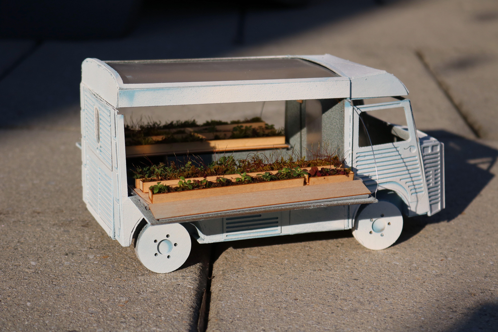
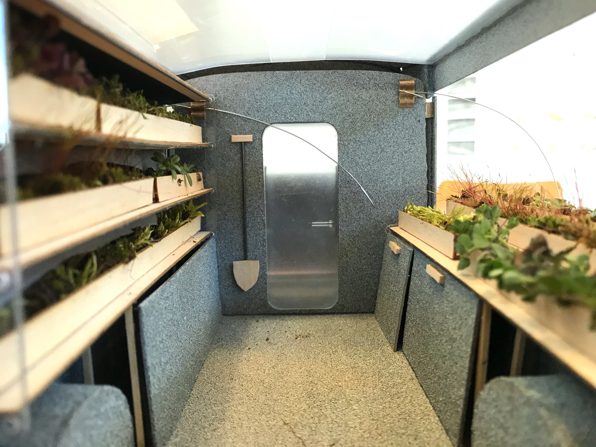
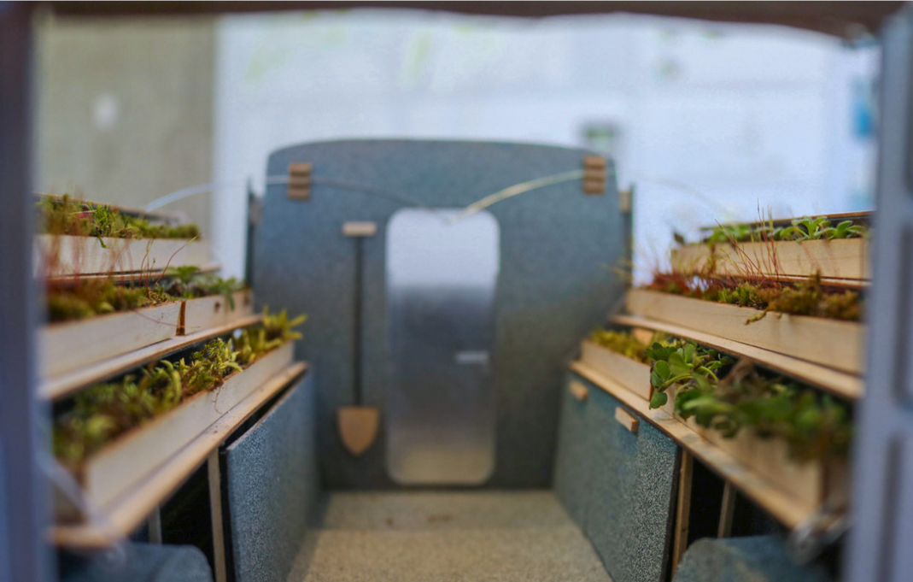

## Overview

A retrofitted Citroën HY that combines a mobile camper van and a deployable garden patch.

## Design

Planter boxes positioned vertically during transit can be lowered into a horizontal position to catch more sun when stopped. A folding cot, stove, and toilet stow into compartments under the planter beds, keeping the footprint compact while providing full living and growing capability.

